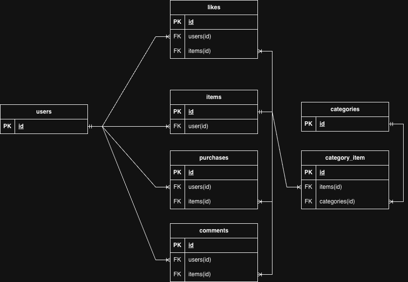

# coachtech フリマ

## アプリケーション概要
coachtechフリマは、アイテムの出品と購入を行うためのフリマアプリケーションです。
ユーザーは商品を出品・購入でき、いいね機能やコメント機能で他のユーザーとコミュニケーションを取ることができます。

## 作成した目的
COACHTECHの模擬案件として、実践に近い開発経験を積み、定義された要件を実装する能力を身につけることを目的としています。

## アプリケーションURL
- アプリケーション：http://localhost/
- phpMyAdmin：http://localhost:8080/
- Mailhog（メールテスト）：http://localhost:8025/

## 機能一覧

### 認証機能
- 会員登録（Laravel Fortify）
- メール認証（Mailhog使用）
- ログイン
- ログアウト

### 商品機能
- 商品一覧表示
- 商品詳細表示
- 商品検索（商品名で部分一致検索）
- 商品出品（画像アップロード対応）
- いいね機能（トグル）
- コメント機能

### ユーザー機能
- マイページ（出品した商品一覧 / 購入した商品一覧）
- プロフィール編集（画像・住所・ユーザー名）
- マイリスト（いいねした商品一覧）

### 購入機能
- 商品購入
- Stripe決済（コンビニ払い・カード払い）
- 配送先住所設定・変更

## 使用技術(実行環境)

- PHP 8.3
- Laravel 11.x
- Laravel Fortify
- MySQL 8.0.26
- nginx 1.21.1
- Docker / Docker Compose
- Stripe
- Mailhog

## テーブル設計

### usersテーブル
| カラム名 | 型 | 制約 | 説明 |
|---------|-----|------|------|
| id | BIGINT UNSIGNED | PRIMARY KEY | ユーザーID |
| name | VARCHAR(255) | NOT NULL | ユーザー名 |
| email | VARCHAR(255) | NOT NULL, UNIQUE | メールアドレス |
| password | VARCHAR(255) | NOT NULL | パスワード |
| is_profile_completed | BOOLEAN | NOT NULL, DEFAULT: false | プロフィール設定完了フラグ |
| profile_image_path | VARCHAR(255) | NULLABLE | プロフィール画像パス |
| postal_code | VARCHAR(255) | NULLABLE | 郵便番号 |
| address | VARCHAR(255) | NULLABLE | 住所 |
| building | VARCHAR(255) | NULLABLE | 建物名 |
| email_verified_at | TIMESTAMP | NULLABLE | メール認証日時 |
| remember_token | VARCHAR(100) | NULLABLE | ログイン保持トークン |
| created_at | TIMESTAMP | NULLABLE | 作成日時 |
| updated_at | TIMESTAMP | NULLABLE | 更新日時 |

### productsテーブル
| カラム名 | 型 | 制約 | 説明 |
|---------|-----|------|------|
| id | BIGINT UNSIGNED | PRIMARY KEY | 商品ID |
| user_id | BIGINT UNSIGNED | NOT NULL, FOREIGN KEY (users.id) | 出品者ID |
| image_path | VARCHAR(255) | NOT NULL | 商品画像パス |
| condition | ENUM('良好', '目立った傷や汚れなし', 'やや傷や汚れあり', '状態が悪い') | NOT NULL | 商品の状態 |
| name | VARCHAR(255) | NOT NULL | 商品名 |
| brand | VARCHAR(255) | NULLABLE | ブランド名 |
| description | TEXT | NOT NULL | 商品説明 |
| price | INT UNSIGNED | NOT NULL | 販売価格 |
| is_sold | BOOLEAN | NOT NULL, DEFAULT: false | 売却済みフラグ |
| created_at | TIMESTAMP | NULLABLE | 作成日時 |
| updated_at | TIMESTAMP | NULLABLE | 更新日時 |

### likesテーブル
| カラム名 | 型 | 制約 | 説明 |
|---------|-----|------|------|
| id | BIGINT UNSIGNED | PRIMARY KEY | いいねID |
| user_id | BIGINT UNSIGNED | NOT NULL, FOREIGN KEY (users.id) | ユーザーID |
| product_id | BIGINT UNSIGNED | NOT NULL, FOREIGN KEY (products.id) | 商品ID |
| created_at | TIMESTAMP | NULLABLE | 作成日時 |
| updated_at | TIMESTAMP | NULLABLE | 更新日時 |

### commentsテーブル
| カラム名 | 型 | 制約 | 説明 |
|---------|-----|------|------|
| id | BIGINT UNSIGNED | PRIMARY KEY | コメントID |
| user_id | BIGINT UNSIGNED | NOT NULL, FOREIGN KEY (users.id) | ユーザーID |
| product_id | BIGINT UNSIGNED | NOT NULL, FOREIGN KEY (products.id) | 商品ID |
| content | TEXT | NOT NULL | コメント内容 |
| created_at | TIMESTAMP | NULLABLE | 作成日時 |
| updated_at | TIMESTAMP | NULLABLE | 更新日時 |

### ordersテーブル
| カラム名 | 型 | 制約 | 説明 |
|---------|-----|------|------|
| id | BIGINT UNSIGNED | PRIMARY KEY | 注文ID |
| user_id | BIGINT UNSIGNED | NOT NULL, FOREIGN KEY (users.id) | 購入者ID |
| product_id | BIGINT UNSIGNED | NOT NULL, FOREIGN KEY (products.id) | 商品ID |
| payment_method | ENUM('コンビニ払い', 'カード払い') | NOT NULL | 支払い方法 |
| postal_code | VARCHAR(255) | NOT NULL | 配送先郵便番号 |
| address | VARCHAR(255) | NOT NULL | 配送先住所 |
| building | VARCHAR(255) | NULLABLE | 配送先建物名 |
| created_at | TIMESTAMP | NULLABLE | 作成日時 |
| updated_at | TIMESTAMP | NULLABLE | 更新日時 |

### categoriesテーブル
| カラム名 | 型 | 制約 | 説明 |
|---------|-----|------|------|
| id | BIGINT UNSIGNED | PRIMARY KEY | カテゴリID |
| name | VARCHAR(255) | NOT NULL, UNIQUE | カテゴリ名 |
| created_at | TIMESTAMP | NULLABLE | 作成日時 |
| updated_at | TIMESTAMP | NULLABLE | 更新日時 |

### category_productsテーブル（中間テーブル）
| カラム名 | 型 | 制約 | 説明 |
|---------|-----|------|------|
| id | BIGINT UNSIGNED | PRIMARY KEY | ID |
| product_id | BIGINT UNSIGNED | NOT NULL, FOREIGN KEY (products.id) | 商品ID |
| category_id | BIGINT UNSIGNED | NOT NULL, FOREIGN KEY (categories.id) | カテゴリID |
| created_at | TIMESTAMP | NULLABLE | 作成日時 |
| updated_at | TIMESTAMP | NULLABLE | 更新日時 |

## ER図



## 環境構築

### Dockerビルド

- git clone <リポジトリURL>
- docker-compose up -d --build

### Laravel環境構築

- docker-compose exec php bash
- composer install
- cp .env.example .env 、環境変数を変更
- php artisan key:generate
- php artisan migrate
- php artisan db:seed
- php artisan storage:link

## テストアカウント

| 項目 | 値 |
|------|-----|
| ユーザー名 | taro |
| メールアドレス | taro@abc.com |
| パスワード | 123abc45 |

※シーダーで作成された商品データが10件登録されています。

## Stripe決済テスト用カード情報

| 項目 | 値 |
|------|-----|
| カード番号 | 4242 4242 4242 4242 |
| 有効期限 | 12/34 |
| セキュリティコード | 123 |
| メールアドレス | 会員登録時に作成したものを使用 |
| 名前 | 会員登録時に作成したものを使用 |

## 開発者向け情報

### テスト実行

#### テスト実装状況
本プロジェクトでは、PHPUnit によるFeatureテストを実装しています。

#### テスト実行方法
```bash
# PHPコンテナに入る
docker-compose exec php bash

# 全テスト実行
php artisan test

# 特定のテストファイルを実行
php artisan test --filter=RegisterTest
```

#### テスト一覧
| テストファイル | テスト内容 | テスト数 |
|--------------|-----------|---------|
| ExampleTest | トップページ表示 | 1 |
| RegisterTest | 会員登録バリデーション・登録処理 | 6 |
| LoginTest | ログインバリデーション・認証処理 | 4 |
| LogoutTest | ログアウト処理 | 1 |
| ProductListTest | 商品一覧表示・Soldラベル・自分の商品非表示 | 3 |
| ProductDetailTest | 商品詳細表示・カテゴリ表示 | 2 |
| ProductSearchTest | 商品検索・マイリスト検索 | 2 |
| ProductExhibitionTest | 商品出品処理 | 1 |
| LikeTest | いいね追加・解除 | 2 |
| MylistTest | マイリスト表示・いいね解除後の非表示 | 2 |
| CommentTest | コメント送信・表示・バリデーション | 4 |
| UserProfileTest | プロフィール表示・出品/購入商品一覧 | 1 |
| ProfileUpdateTest | プロフィール編集画面の表示 | 1 |
| PurchaseTest | 購入処理・Soldラベル・購入履歴 | 3 |
| PaymentMethodTest | 支払い方法選択表示 | 1 |
| AddressUpdateTest | 配送先住所変更・注文への反映 | 2 |

**合計：36テストケース**

#### 既知の注意事項
- Stripe決済のテストは、外部API連携のためFeatureテストではOrder直接作成で代替しています
- 画像アップロードテストは、GD拡張が未インストールのため `UploadedFile::fake()->create()` を使用しています
- 支払い方法のJavaScript動的切り替えはFeatureテストでは検証できないため、選択肢の存在確認のみ実施しています

### キャッシュクリア
```bash
php artisan config:clear
php artisan cache:clear
php artisan view:clear
```

### マイグレーションのリセット
```bash
php artisan migrate:fresh --seed
```

## トラブルシューティング

### Dockerコンテナが起動しない
```bash
docker-compose down
docker-compose up -d --build
```

### パーミッションエラー
```bash
chmod -R 777 storage bootstrap/cache
```

### データベース接続エラー
- .envファイルのDB設定を確認
- Dockerコンテナが起動しているか確認: `docker-compose ps`

## 実装上の判断事項

### 1. 配送先住所のバリデーションについて
購入画面にアクセスする時点で、プロフィール編集画面にて住所の登録が完了しています。
初期値としてプロフィールの住所が使用される仕様のため、配送先住所のバリデーション（AddressRequest）は購入フローでは適用していません。

### 2. RegisterRequest / LoginRequest ファイルについて
Laravel Fortifyの認証フローでは、FormRequestではなくCreateNewUserクラス内でValidator::make()を使用する必要があります。
そのため、RegisterRequest.phpおよびLoginRequest.phpはFortifyの処理フロー上では直接使用されていませんが、仕様書に記載されているためファイルとして残しています。

### 3. カテゴリの複数選択対応
商品出品時のカテゴリ複数選択に対応するため、ExhibitionRequest.phpでは配列バリデーション（`categories.*`）を実装しています。
